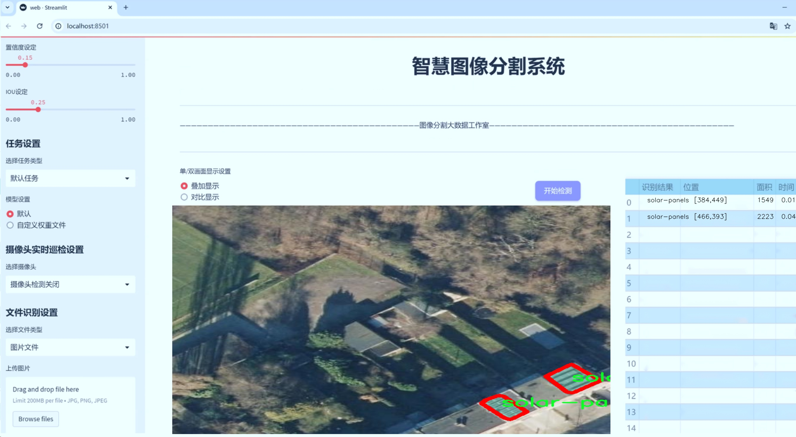
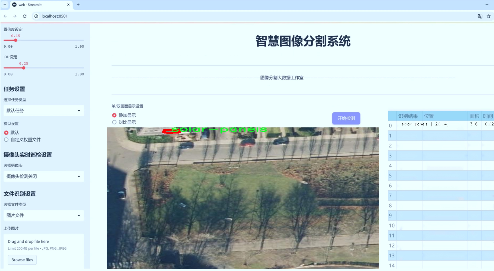
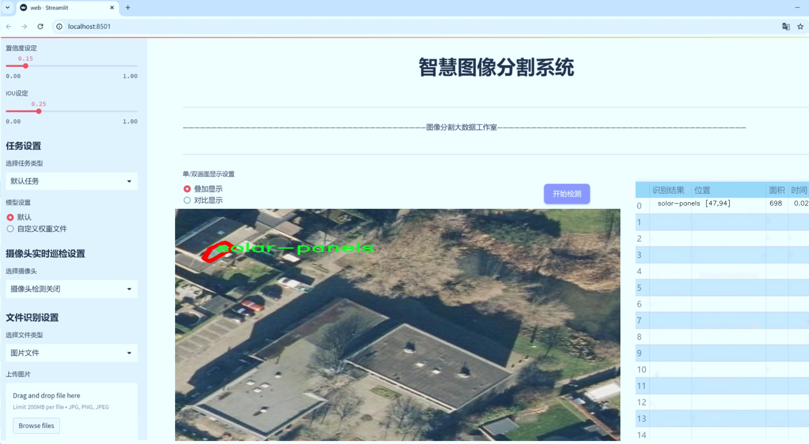
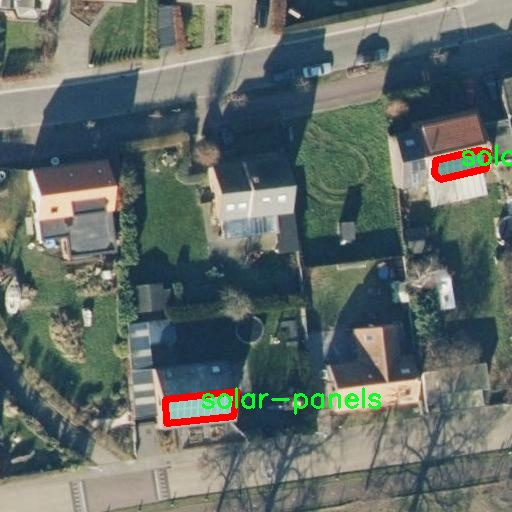
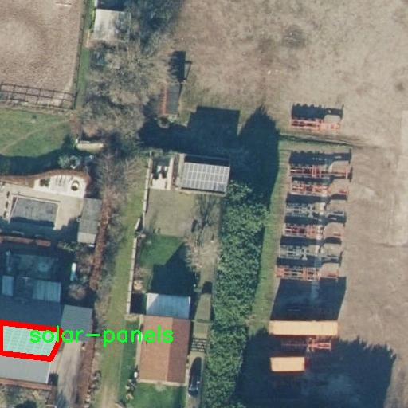
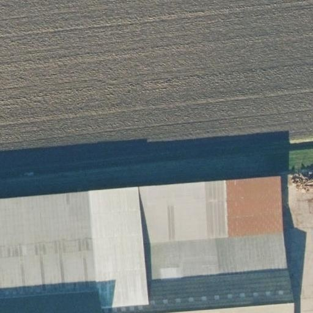
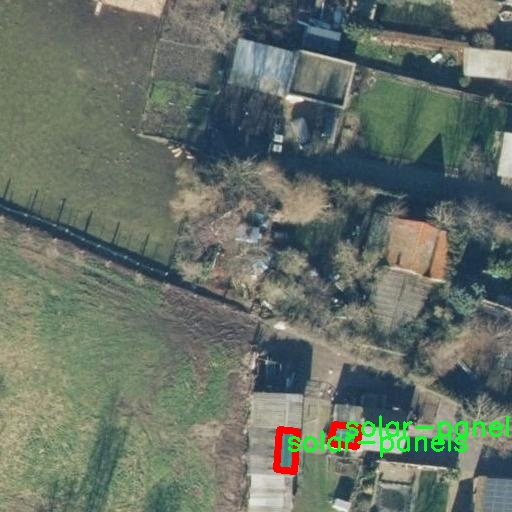
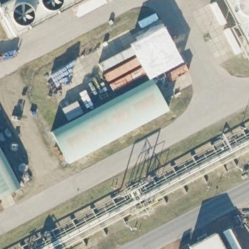

# 航拍遥感太阳能面板识别图像分割系统： yolov8-seg-EfficientRepBiPAN

### 1.研究背景与意义

[参考博客](https://gitee.com/YOLOv8_YOLOv11_Segmentation_Studio/projects)

[博客来源](https://kdocs.cn/l/cszuIiCKVNis)

研究背景与意义

随着全球对可再生能源的日益重视，太阳能作为一种清洁、可再生的能源形式，正逐渐成为各国能源结构转型的重要组成部分。太阳能面板的广泛应用不仅有助于减少温室气体排放，还能有效降低对化石燃料的依赖。然而，太阳能面板的安装、维护和监测过程中的效率提升，依赖于高效的图像识别与分析技术。航拍遥感技术因其高效、广域的特性，成为了太阳能面板监测的重要手段。通过对航拍图像的分析，可以快速、准确地识别和定位太阳能面板，从而为后续的维护和管理提供数据支持。

在这一背景下，基于改进YOLOv8的航拍遥感太阳能面板识别图像分割系统的研究显得尤为重要。YOLO（You Only Look Once）系列模型因其实时性和高准确率，已成为目标检测领域的主流算法之一。YOLOv8作为其最新版本，进一步提升了模型的性能，尤其在处理复杂场景和小目标检测方面展现出优越的能力。然而，传统的YOLOv8模型在处理航拍图像时，仍然面临着目标遮挡、光照变化和背景复杂等挑战。因此，针对航拍遥感图像的特性，对YOLOv8进行改进，构建一个专门用于太阳能面板识别的图像分割系统，具有重要的理论价值和实际意义。

本研究将利用“solar-antwerp”数据集，该数据集包含5400张航拍图像，专注于太阳能面板的实例分割任务。该数据集的单一类别（太阳能面板）使得模型训练更加专注，能够有效提升识别精度和分割效果。通过对数据集的深入分析与处理，结合改进的YOLOv8模型，我们期望能够实现对太阳能面板的高效、准确的识别与分割。这不仅能够为太阳能行业提供精准的监测手段，还能为相关政策的制定与实施提供数据支持，推动可再生能源的可持续发展。

此外，航拍遥感技术与深度学习的结合，能够为智能城市、环境监测等领域提供新的解决方案。通过对太阳能面板的精准识别与监测，能够为城市的能源管理提供重要依据，促进绿色建筑和可持续发展的理念落地。研究成果的推广应用，将有助于提升太阳能面板的使用效率，降低维护成本，从而推动太阳能行业的健康发展。

综上所述，基于改进YOLOv8的航拍遥感太阳能面板识别图像分割系统的研究，不仅具有重要的学术价值，也为实际应用提供了有力的技术支持。通过这一研究，我们希望能够为太阳能面板的高效监测与管理提供创新的解决方案，助力全球可再生能源的推广与应用。

### 2.图片演示







注意：本项目提供完整的训练源码数据集和训练教程,由于此博客编辑较早,暂不提供权重文件（best.pt）,需要按照6.训练教程进行训练后实现上图效果。

### 3.视频演示

[3.1 视频演示](https://www.bilibili.com/video/BV1AXzRYeERw/)

### 4.数据集信息

##### 4.1 数据集类别数＆类别名

nc: 1
names: ['solar-panels']


##### 4.2 数据集信息简介

数据集信息展示

在现代遥感技术的迅速发展中，航拍图像的分析与处理成为了研究的热点之一。尤其是在太阳能面板的识别与分割领域，准确的图像处理技术对于提高太阳能资源的利用效率具有重要意义。本研究所使用的数据集名为“solar-antwerp”，专门用于训练改进版的YOLOv8-seg模型，以实现高效的航拍遥感太阳能面板识别图像分割。

“solar-antwerp”数据集的构建基于丰富的航拍图像，涵盖了多种不同环境下的太阳能面板。这些图像来源于不同的地理位置，确保了数据集的多样性和代表性。数据集中包含的类别数量为1，具体类别为“solar-panels”。这一类别的选择反映了本研究的重点，即聚焦于太阳能面板的检测与分割，而不涉及其他物体或类别的干扰，从而提高模型的专注度和识别精度。

在数据集的构建过程中，研究团队采用了高分辨率的航拍图像，确保每一幅图像都能清晰地展示太阳能面板的特征。图像的获取过程经过精心设计，涵盖了不同的天气条件、时间段和地理环境，以增强模型的泛化能力。通过这种方式，数据集不仅能够反映太阳能面板在各种实际应用场景中的表现，还能够帮助模型学习到不同环境下的特征变化。

数据集中的每一幅图像都经过了精确的标注，确保太阳能面板的边界被准确地框定。这一过程不仅依赖于人工标注的细致工作，还结合了先进的图像处理技术，以提高标注的准确性和一致性。通过这种高质量的标注，YOLOv8-seg模型能够在训练过程中获得丰富的特征信息，从而提升其在实际应用中的识别能力。

在数据集的使用过程中，研究者们将“solar-antwerp”数据集分为训练集和验证集，以便于模型的训练和性能评估。训练集用于模型的学习，而验证集则用于实时监测模型的性能，确保其在未见数据上的表现同样优秀。这种分割策略有助于避免过拟合现象的发生，从而提升模型的泛化能力。

通过对“solar-antwerp”数据集的深入分析与应用，研究团队希望能够在航拍遥感领域实现更高效的太阳能面板识别与分割。这不仅将推动相关技术的发展，也为未来的太阳能资源管理和优化提供了重要的数据支持。随着模型的不断改进与优化，预计将会在实际应用中取得显著的成果，为可再生能源的利用贡献力量。











### 5.项目依赖环境部署教程（零基础手把手教学）

[5.1 环境部署教程链接（零基础手把手教学）](https://www.bilibili.com/video/BV1jG4Ve4E9t/?vd_source=bc9aec86d164b67a7004b996143742dc)


[5.2 安装Python虚拟环境创建和依赖库安装视频教程链接（零基础手把手教学）](https://www.bilibili.com/video/BV1nA4VeYEze/?vd_source=bc9aec86d164b67a7004b996143742dc)

### 6.手把手YOLOV8-seg训练视频教程（零基础手把手教学）

[6.1 手把手YOLOV8-seg训练视频教程（零基础小白有手就能学会）](https://www.bilibili.com/video/BV1cA4VeYETe/?vd_source=bc9aec86d164b67a7004b996143742dc)


按照上面的训练视频教程链接加载项目提供的数据集，运行train.py即可开始训练



     Epoch   gpu_mem       box       obj       cls    labels  img_size
     1/200     0G   0.01576   0.01955  0.007536        22      1280: 100%|██████████| 849/849 [14:42<00:00,  1.04s/it]
               Class     Images     Labels          P          R     mAP@.5 mAP@.5:.95: 100%|██████████| 213/213 [01:14<00:00,  2.87it/s]
                 all       3395      17314      0.994      0.957      0.0957      0.0843

     Epoch   gpu_mem       box       obj       cls    labels  img_size
     2/200     0G   0.01578   0.01923  0.007006        22      1280: 100%|██████████| 849/849 [14:44<00:00,  1.04s/it]
               Class     Images     Labels          P          R     mAP@.5 mAP@.5:.95: 100%|██████████| 213/213 [01:12<00:00,  2.95it/s]
                 all       3395      17314      0.996      0.956      0.0957      0.0845

     Epoch   gpu_mem       box       obj       cls    labels  img_size
     3/200     0G   0.01561    0.0191  0.006895        27      1280: 100%|██████████| 849/849 [10:56<00:00,  1.29it/s]
               Class     Images     Labels          P          R     mAP@.5 mAP@.5:.95: 100%|███████   | 187/213 [00:52<00:00,  4.04it/s]
                 all       3395      17314      0.996      0.957      0.0957      0.0845


### 7.50+种全套YOLOV8-seg创新点加载调参实验视频教程（一键加载写好的改进模型的配置文件）

[7.1 50+种全套YOLOV8-seg创新点加载调参实验视频教程（一键加载写好的改进模型的配置文件）](https://www.bilibili.com/video/BV1Hw4VePEXv/?vd_source=bc9aec86d164b67a7004b996143742dc)

### YOLOV8-seg算法简介

原始YOLOv8-seg算法原理

YOLOv8-seg算法是由Glenn-Jocher提出的最新一代YOLO系列目标检测算法，旨在在保持高效性的同时，进一步提升目标检测的精度和灵活性。作为YOLO系列的延续，YOLOv8-seg在数据预处理、网络结构、标签分配策略等多个方面进行了创新和改进，尤其是在分割任务中的应用，使其在计算机视觉领域中展现出更为卓越的性能。

首先，YOLOv8-seg在数据预处理方面继承了YOLOv5的成功经验，采用了多种数据增强技术来提升模型的泛化能力。具体而言，算法使用了马赛克增强、混合增强、空间扰动和颜色扰动等四种主要的增强手段。这些增强方法不仅丰富了训练数据的多样性，还有效地提高了模型对不同场景和光照条件的适应能力。马赛克增强通过将多张图像拼接在一起，模拟了不同物体在复杂背景下的情况；混合增强则通过对两张图像进行加权融合，进一步增加了样本的多样性。这些预处理技术为YOLOv8-seg的训练提供了坚实的基础，使得模型在实际应用中能够更好地应对各种挑战。

在网络结构方面，YOLOv8-seg的骨干网络依然沿用了YOLOv5的设计理念，但在此基础上进行了重要的创新。YOLOv8引入了C2f模块，替代了YOLOv5中的C3模块。C2f模块通过增加更多的分支来丰富梯度回传时的支流，从而增强了特征提取的能力。这种设计使得网络在捕捉多层次特征时更加灵活，有助于提高模型对复杂场景的理解能力。此外，YOLOv8-seg继续采用FPN-PAN结构，以实现多尺度特征的有效融合。这种特征金字塔结构能够充分利用不同尺度的特征信息，从而提升模型在不同物体尺寸下的检测性能。

YOLOv8-seg的检测头结构也经历了显著的变革。与之前版本的耦合检测头不同，YOLOv8-seg采用了解耦头结构。这种结构将分类和定位任务分开处理，分别通过两条并行的分支提取类别特征和位置特征。通过这种方式，模型能够更专注于每个任务的特征提取，进而提高检测的准确性和效率。解耦头的设计使得YOLOv8-seg在处理复杂场景时，能够更好地平衡分类和定位的精度，适应多样化的应用需求。

在标签分配策略方面，YOLOv8-seg摒弃了传统的候选框聚类方法，转而采用了TOOD策略。这种动态标签分配策略使得模型在处理正负样本时更加灵活，能够根据实际情况动态调整标签的分配。YOLOv8-seg的损失函数主要由类别损失和位置损失两部分组成，其中类别损失采用了VFL Loss（Varifocal Loss），而位置损失则结合了CIoULoss与DFLLoss。这种损失函数的设计使得模型在训练过程中能够更好地关注高质量的正样本，从而提高整体的检测性能。

YOLOv8-seg在处理分割任务时，进一步扩展了YOLOv8的功能。通过引入像素级的分割信息，YOLOv8-seg能够在目标检测的基础上，实现更为精细的物体分割。这一特性使得YOLOv8-seg在诸如自动驾驶、医学影像分析等领域展现出更为广泛的应用潜力。通过对图像中每个像素的分类，YOLOv8-seg能够提供更为细致的物体边界信息，提升了模型在复杂场景下的表现。

总的来说，YOLOv8-seg算法通过对数据预处理、网络结构、标签分配策略等多个方面的创新，展现出强大的目标检测和分割能力。其在高效性和精度上的平衡，使得YOLOv8-seg成为当前计算机视觉领域中一款极具竞争力的模型。随着YOLOv8-seg的不断发展和完善，预计其将在更多实际应用中发挥重要作用，推动计算机视觉技术的进一步进步。


### 9.系统功能展示（检测对象为举例，实际内容以本项目数据集为准）

图9.1.系统支持检测结果表格显示

  图9.2.系统支持置信度和IOU阈值手动调节

  图9.3.系统支持自定义加载权重文件best.pt(需要你通过步骤5中训练获得)

  图9.4.系统支持摄像头实时识别

  图9.5.系统支持图片识别

  图9.6.系统支持视频识别

  图9.7.系统支持识别结果文件自动保存

  图9.8.系统支持Excel导出检测结果数据


### 10.50+种全套YOLOV8-seg创新点原理讲解（非科班也可以轻松写刊发刊，V11版本正在科研待更新）

#### 10.1 由于篇幅限制，每个创新点的具体原理讲解就不一一展开，具体见下列网址中的创新点对应子项目的技术原理博客网址【Blog】：


[10.1 50+种全套YOLOV8-seg创新点原理讲解链接](https://gitee.com/qunmasj/good)

#### 10.2 部分改进模块原理讲解(完整的改进原理见上图和技术博客链接)【如果此小节的图加载失败可以通过CSDN或者Github搜索该博客的标题访问原始博客，原始博客图片显示正常】

### YOLOv8简介

按照官方描述，YOLOv8 是一个 SOTA 模型，它建立在以前 YOLO 版本的成功基础上，并引入了新的功能和改进，以进一步提升性能和灵活性。具体创新包括一个新的骨干网络、一个新的 Ancher-Free 检测头和一个新的损失函数，可以在从 CPU 到 GPU 的各种硬件平台上运行。

不过 ultralytics 并没有直接将开源库命名为 YOLOv8，而是直接使用 ultralytics 这个词，原因是 ultralytics 将这个库定位为算法框架，而非某一个特定算法，一个主要特点是可扩展性。其希望这个库不仅仅能够用于 YOLO 系列模型，而是能够支持非 YOLO 模型以及分类分割姿态估计等各类任务。
总而言之，ultralytics 开源库的两个主要优点是：

融合众多当前 SOTA 技术于一体
未来将支持其他 YOLO 系列以及 YOLO 之外的更多算法


下表为官方在 COCO Val 2017 数据集上测试的 mAP、参数量和 FLOPs 结果。可以看出 YOLOv8 相比 YOLOv5 精度提升非常多，但是 N/S/M 模型相应的参数量和 FLOPs 都增加了不少，从上图也可以看出相比 YOLOV5 大部分模型推理速度变慢了。


额外提一句，现在各个 YOLO 系列改进算法都在 COCO 上面有明显性能提升，但是在自定义数据集上面的泛化性还没有得到广泛验证，至今依然听到不少关于 YOLOv5 泛化性能较优异的说法。对各系列 YOLO 泛化性验证也是 MMYOLO 中一个特别关心和重点发力的方向。

### YOLO-MS简介
实时目标检测，以YOLO系列为例，已在工业领域中找到重要应用，特别是在边缘设备（如无人机和机器人）中。与之前的目标检测器不同，实时目标检测器旨在在速度和准确性之间追求最佳平衡。为了实现这一目标，提出了大量的工作：从第一代DarkNet到CSPNet，再到最近的扩展ELAN，随着性能的快速增长，实时目标检测器的架构经历了巨大的变化。

尽管性能令人印象深刻，但在不同尺度上识别对象仍然是实时目标检测器面临的基本挑战。这促使作者设计了一个强大的编码器架构，用于学习具有表现力的多尺度特征表示。具体而言，作者从两个新的角度考虑为实时目标检测编码多尺度特征：

从局部视角出发，作者设计了一个具有简单而有效的分层特征融合策略的MS-Block。受到Res2Net的启发，作者在MS-Block中引入了多个分支来进行特征提取，但不同的是，作者使用了一个带有深度卷积的 Inverted Bottleneck Block块，以实现对大Kernel的高效利用。

从全局视角出发，作者提出随着网络加深逐渐增加卷积的Kernel-Size。作者在浅层使用小Kernel卷积来更高效地处理高分辨率特征。另一方面，在深层中，作者采用大Kernel卷积来捕捉广泛的信息。

基于以上设计原则，作者呈现了作者的实时目标检测器，称为YOLO-MS。为了评估作者的YOLO-MS的性能，作者在MS COCO数据集上进行了全面的实验。还提供了与其他最先进方法的定量比较，以展示作者方法的强大性能。如图1所示，YOLO-MS在计算性能平衡方面优于其他近期的实时目标检测器。


具体而言，YOLO-MS-XS在MS COCO上获得了43%+的AP得分，仅具有450万个可学习参数和8.7亿个FLOPs。YOLO-MS-S和YOLO-MS分别获得了46%+和51%+的AP，可学习参数分别为810万和2220万。此外，作者的工作还可以作为其他YOLO模型的即插即用模块。通常情况下，作者的方法可以将YOLOv8的AP从37%+显著提高到40%+，甚至还可以使用更少的参数和FLOPs。


#### Multi-Scale Building Block Design
CSP Block是一个基于阶段级梯度路径的网络，平衡了梯度组合和计算成本。它是广泛应用于YOLO系列的基本构建块。已经提出了几种变体，包括YOLOv4和YOLOv5中的原始版本，Scaled YOLOv4中的CSPVoVNet，YOLOv7中的ELAN，以及RTMDet中提出的大Kernel单元。作者在图2(a)和图2(b)中分别展示了原始CSP块和ELAN的结构。


上述实时检测器中被忽视的一个关键方面是如何在基本构建块中编码多尺度特征。其中一个强大的设计原则是Res2Net，它聚合了来自不同层次的特征以增强多尺度表示。然而，这一原则并没有充分探索大Kernel卷积的作用，而大Kernel卷积已经在基于CNN的视觉识别任务模型中证明有效。将大Kernel卷积纳入Res2Net的主要障碍在于它们引入的计算开销，因为构建块采用了标准卷积。在作者的方法中，作者提出用 Inverted Bottleneck Block替代标准的3 × 3卷积，以享受大Kernel卷积的好处。

基于前面的分析，作者提出了一个带有分层特征融合策略的全新Block，称为MS-Block，以增强实时目标检测器在提取多尺度特征时的能力，同时保持快速的推理速度。

MS-Block的具体结构如图2(c)所示。假设是输入特征。通过1×1卷积的转换后，X的通道维度增加到n*C。然后，作者将X分割成n个不同的组，表示为，其中。为了降低计算成本，作者选择n为3。

注意，除了之外，每个其他组都经过一个 Inverted Bottleneck Block层，用表示，其中k表示Kernel-Size，以获得。的数学表示如下：


根据这个公式，该博客的作者不将 Inverted Bottleneck Block层连接，使其作为跨阶段连接，并保留来自前面层的信息。最后，作者将所有分割连接在一起，并应用1×1卷积来在所有分割之间进行交互，每个分割都编码不同尺度的特征。当网络加深时，这个1×1卷积也用于调整通道数。

#### Heterogeneous Kernel Selection Protocol
除了构建块的设计外，作者还从宏观角度探讨了卷积的使用。之前的实时目标检测器在不同的编码器阶段采用了同质卷积（即具有相同Kernel-Size的卷积），但作者认为这不是提取多尺度语义信息的最佳选项。

在金字塔结构中，从检测器的浅阶段提取的高分辨率特征通常用于捕捉细粒度语义，将用于检测小目标。相反，来自网络较深阶段的低分辨率特征用于捕捉高级语义，将用于检测大目标。如果作者在所有阶段都采用统一的小Kernel卷积，深阶段的有效感受野（ERF）将受到限制，影响大目标的性能。在每个阶段中引入大Kernel卷积可以帮助解决这个问题。然而，具有大的ERF的大Kernel可以编码更广泛的区域，这增加了在小目标外部包含噪声信息的概率，并且降低了推理速度。

在这项工作中，作者建议在不同阶段中采用异构卷积，以帮助捕获更丰富的多尺度特征。具体来说，在编码器的第一个阶段中，作者采用最小Kernel卷积，而最大Kernel卷积位于最后一个阶段。随后，作者逐步增加中间阶段的Kernel-Size，使其与特征分辨率的增加保持一致。这种策略允许提取细粒度和粗粒度的语义信息，增强了编码器的多尺度特征表示能力。

正如图所示，作者将k的值分别分配给编码器中的浅阶段到深阶段，取值为3、5、7和9。作者将其称为异构Kernel选择（HKS）协议。


作者的HKS协议能够在深层中扩大感受野，而不会对浅层产生任何其他影响。此外，HKS不仅有助于编码更丰富的多尺度特征，还确保了高效的推理。

如表1所示，将大Kernel卷积应用于高分辨率特征会产生较高的计算开销。然而，作者的HKS协议在低分辨率特征上采用大Kernel卷积，从而与仅使用大Kernel卷积相比，大大降低了计算成本。


在实践中，作者经验性地发现，采用HKS协议的YOLO-MS的推理速度几乎与仅使用深度可分离的3 × 3卷积相同。

#### Architecture
如图所示，作者模型的Backbone由4个阶段组成，每个阶段后面跟随1个步长为2的3 × 3卷积进行下采样。在第3个阶段后，作者添加了1个SPP块，与RTMDet中一样。在作者的编码器上，作者使用PAFPN作为Neck来构建特征金字塔[31, 35]。它融合了从Backbone不同阶段提取的多尺度特征。Neck中使用的基本构建块也是作者的MS-Block，在其中使用3 × 3深度可分离卷积进行快速推理。

此外，为了在速度和准确性之间取得更好的平衡，作者将Backbone中多级特征的通道深度减半。作者提供了3个不同尺度的YOLO-MS变体，即YOLO-MS-XS、YOLO-MS-S和YOLO-MS。不同尺度的YOLO-MS的详细配置列在表2中。对于YOLO-MS的其他部分，作者将其保持与RTMDet相同。


### 11.项目核心源码讲解（再也不用担心看不懂代码逻辑）

#### 11.1 ultralytics\utils\ops.py

以下是对代码中最核心部分的提取和详细中文注释：

```python
import torch
import torchvision

def non_max_suppression(
        prediction,
        conf_thres=0.25,
        iou_thres=0.45,
        classes=None,
        agnostic=False,
        multi_label=False,
        labels=(),
        max_det=300,
        nc=0,  # 类别数量（可选）
        max_time_img=0.05,
        max_nms=30000,
        max_wh=7680,
):
    """
    对一组边界框执行非最大抑制（NMS），支持掩码和每个框多个标签。

    参数：
        prediction (torch.Tensor): 形状为 (batch_size, num_classes + 4 + num_masks, num_boxes) 的张量，
            包含预测的框、类别和掩码。张量应为模型输出格式，例如 YOLO。
        conf_thres (float): 置信度阈值，低于该值的框将被过滤掉。
        iou_thres (float): IoU 阈值，低于该值的框在 NMS 过程中将被过滤掉。
        classes (List[int]): 要考虑的类别索引列表。如果为 None，则考虑所有类别。
        agnostic (bool): 如果为 True，模型对类别数量不敏感，所有类别将被视为一个。
        multi_label (bool): 如果为 True，每个框可能有多个标签。
        labels (List[List[Union[int, float, torch.Tensor]]]): 每个图像的先验标签列表。
        max_det (int): NMS 后要保留的最大框数量。
        nc (int, optional): 模型输出的类别数量。任何索引在此之后将被视为掩码。
        max_time_img (float): 处理一张图像的最大时间（秒）。
        max_nms (int): 传递给 torchvision.ops.nms() 的最大框数量。
        max_wh (int): 像素中最大框的宽度和高度。

    返回：
        (List[torch.Tensor]): 长度为 batch_size 的列表，每个元素是形状为 (num_boxes, 6 + num_masks) 的张量，
            包含保留的框，列为 (x1, y1, x2, y2, confidence, class, mask1, mask2, ...)。
    """

    # 检查输入参数的有效性
    assert 0 <= conf_thres <= 1, f'无效的置信度阈值 {conf_thres}, 有效值在 0.0 和 1.0 之间'
    assert 0 <= iou_thres <= 1, f'无效的 IoU {iou_thres}, 有效值在 0.0 和 1.0 之间'
    
    # 如果预测是列表或元组，选择推理输出
    if isinstance(prediction, (list, tuple)):
        prediction = prediction[0]  # 选择仅推理输出

    device = prediction.device  # 获取设备信息
    mps = 'mps' in device.type  # 检查是否为 Apple MPS
    if mps:  # 如果是 MPS，转换张量到 CPU
        prediction = prediction.cpu()
    
    bs = prediction.shape[0]  # 批量大小
    nc = nc or (prediction.shape[1] - 4)  # 类别数量
    nm = prediction.shape[1] - nc - 4  # 掩码数量
    mi = 4 + nc  # 掩码起始索引
    xc = prediction[:, 4:mi].amax(1) > conf_thres  # 置信度候选框

    # 设置时间限制
    time_limit = 0.5 + max_time_img * bs  # 超过时间限制后退出
    multi_label &= nc > 1  # 多标签每个框（增加处理时间）

    prediction = prediction.transpose(-1, -2)  # 转置张量形状
    prediction[..., :4] = xywh2xyxy(prediction[..., :4])  # 转换坐标格式

    output = [torch.zeros((0, 6 + nm), device=prediction.device)] * bs  # 初始化输出
    for xi, x in enumerate(prediction):  # 遍历每张图像的推理结果
        x = x[xc[xi]]  # 仅保留置信度高的框

        # 如果存在先验标签，合并到当前框
        if labels and len(labels[xi]):
            lb = labels[xi]
            v = torch.zeros((len(lb), nc + nm + 4), device=x.device)
            v[:, :4] = xywh2xyxy(lb[:, 1:5])  # 转换标签框坐标
            v[range(len(lb)), lb[:, 0].long() + 4] = 1.0  # 设置类别
            x = torch.cat((x, v), 0)  # 合并框和标签

        if not x.shape[0]:  # 如果没有框，继续处理下一张图像
            continue

        # 拆分框、类别和掩码
        box, cls, mask = x.split((4, nc, nm), 1)

        if multi_label:
            i, j = torch.where(cls > conf_thres)  # 获取多标签框
            x = torch.cat((box[i], x[i, 4 + j, None], j[:, None].float(), mask[i]), 1)
        else:  # 仅保留最佳类别
            conf, j = cls.max(1, keepdim=True)
            x = torch.cat((box, conf, j.float(), mask), 1)[conf.view(-1) > conf_thres]

        # 按类别过滤框
        if classes is not None:
            x = x[(x[:, 5:6] == torch.tensor(classes, device=x.device)).any(1)]

        n = x.shape[0]  # 当前框数量
        if not n:  # 如果没有框，继续处理下一张图像
            continue
        if n > max_nms:  # 如果框数量超过最大限制，按置信度排序并去除多余框
            x = x[x[:, 4].argsort(descending=True)[:max_nms]]

        # 批量 NMS
        c = x[:, 5:6] * (0 if agnostic else max_wh)  # 类别偏移
        boxes, scores = x[:, :4] + c, x[:, 4]  # 框和置信度
        i = torchvision.ops.nms(boxes, scores, iou_thres)  # 执行 NMS
        i = i[:max_det]  # 限制检测框数量

        output[xi] = x[i]  # 保存当前图像的输出
        if (time.time() - t) > time_limit:  # 检查时间限制
            break  # 超过时间限制，退出

    return output  # 返回处理后的输出
```

### 核心功能概述
1. **非最大抑制 (NMS)**：该函数用于过滤掉重叠的边界框，只保留置信度最高的框，以减少重复检测。
2. **框和类别处理**：支持多标签和类别过滤，能够处理不同的输入格式和先验标签。
3. **时间限制**：在处理大批量图像时，设定时间限制以避免长时间运行。

### 代码注释
代码中的每个重要步骤都有详细的中文注释，解释了参数的含义、功能的实现逻辑以及返回值的格式。这些注释有助于理解函数的整体工作流程和每个步骤的目的。

这个文件是Ultralytics YOLO项目中的一个工具模块，主要用于处理与目标检测相关的操作。它包含了多个函数和一个上下文管理器类，用于性能分析。以下是对文件中主要内容的逐步分析。

首先，文件引入了一些必要的库，包括`contextlib`、`math`、`re`、`time`、`cv2`、`numpy`、`torch`和`torchvision`。这些库提供了基本的数学运算、时间测量、图像处理和深度学习所需的功能。

接下来，定义了一个`Profile`类，用于性能分析。这个类可以作为装饰器或上下文管理器使用，能够记录代码块的执行时间。通过`__enter__`和`__exit__`方法，用户可以方便地获取某段代码的执行时间，并以字符串形式返回。

然后，文件中定义了一些函数，这些函数主要用于处理边界框和分割掩码。`segment2box`函数将分割标签转换为边界框标签，并确保这些框在图像内部。`scale_boxes`函数则用于根据图像的不同尺寸调整边界框的大小。

`make_divisible`函数用于将一个数字调整为指定的可整除值，通常用于调整网络层的输出尺寸，以满足特定的模型结构要求。

`non_max_suppression`函数实现了非极大值抑制（NMS），用于过滤重叠的边界框。它支持多标签和掩码的处理，能够根据置信度和IoU阈值来选择最佳的边界框。

`clip_boxes`和`clip_coords`函数用于将边界框和坐标限制在图像的边界内，确保不会超出图像的范围。

`scale_image`函数用于将掩码调整为原始图像的大小，`xyxy2xywh`和`xywh2xyxy`函数则用于在不同的边界框表示格式之间进行转换。

文件中还定义了一些其他的辅助函数，如`segments2boxes`、`resample_segments`、`crop_mask`等，这些函数用于处理分割掩码、重新采样和裁剪掩码。

最后，文件中还包含了一些字符串处理的函数，如`clean_str`，用于清理字符串中的特殊字符。

总体来说，这个文件提供了一系列用于目标检测和图像处理的工具函数，帮助用户在使用YOLO模型时进行数据预处理和后处理。通过这些函数，用户可以方便地进行边界框的转换、缩放、裁剪和性能分析等操作。

#### 11.2 ultralytics\models\sam\amg.py

以下是代码中最核心的部分，并附上详细的中文注释：

```python
import torch

def is_box_near_crop_edge(boxes: torch.Tensor,
                          crop_box: List[int],
                          orig_box: List[int],
                          atol: float = 20.0) -> torch.Tensor:
    """
    判断给定的边界框是否接近裁剪边缘。

    参数：
    - boxes: 包含多个边界框的张量，格式为 (N, 4)，其中 N 是边界框的数量。
    - crop_box: 当前裁剪框的坐标，格式为 [x0, y0, x1, y1]。
    - orig_box: 原始图像的边界框坐标，格式为 [x0, y0, x1, y1]。
    - atol: 允许的绝对误差，默认为 20.0。

    返回：
    - 返回一个布尔张量，指示每个边界框是否接近裁剪边缘。
    """
    # 将裁剪框和原始框转换为张量
    crop_box_torch = torch.as_tensor(crop_box, dtype=torch.float, device=boxes.device)
    orig_box_torch = torch.as_tensor(orig_box, dtype=torch.float, device=boxes.device)
    
    # 将边界框转换为未裁剪的坐标
    boxes = uncrop_boxes_xyxy(boxes, crop_box).float()
    
    # 检查边界框是否接近裁剪框的边缘
    near_crop_edge = torch.isclose(boxes, crop_box_torch[None, :], atol=atol, rtol=0)
    # 检查边界框是否接近原始图像的边缘
    near_image_edge = torch.isclose(boxes, orig_box_torch[None, :], atol=atol, rtol=0)
    
    # 仅保留接近裁剪边缘但不接近原始图像边缘的框
    near_crop_edge = torch.logical_and(near_crop_edge, ~near_image_edge)
    
    # 返回是否有任何边界框接近裁剪边缘
    return torch.any(near_crop_edge, dim=1)


def uncrop_boxes_xyxy(boxes: torch.Tensor, crop_box: List[int]) -> torch.Tensor:
    """
    通过添加裁剪框的偏移量来恢复边界框的原始位置。

    参数：
    - boxes: 包含多个边界框的张量，格式为 (N, 4)。
    - crop_box: 当前裁剪框的坐标，格式为 [x0, y0, x1, y1]。

    返回：
    - 返回恢复后的边界框张量。
    """
    x0, y0, _, _ = crop_box
    # 创建偏移量张量
    offset = torch.tensor([[x0, y0, x0, y0]], device=boxes.device)
    
    # 检查 boxes 是否有通道维度
    if len(boxes.shape) == 3:
        offset = offset.unsqueeze(1)
    
    # 返回添加偏移量后的边界框
    return boxes + offset


def batched_mask_to_box(masks: torch.Tensor) -> torch.Tensor:
    """
    计算掩码周围的边界框，格式为 XYXY。

    参数：
    - masks: 输入掩码张量，格式为 C1xC2x...xHxW。

    返回：
    - 返回边界框张量，格式为 C1xC2x...x4。
    """
    # 如果掩码为空，返回 [0, 0, 0, 0]
    if torch.numel(masks) == 0:
        return torch.zeros(*masks.shape[:-2], 4, device=masks.device)

    # 规范化形状为 CxHxW
    shape = masks.shape
    h, w = shape[-2:]
    masks = masks.flatten(0, -3) if len(shape) > 2 else masks.unsqueeze(0)
    
    # 获取上边和下边的坐标
    in_height, _ = torch.max(masks, dim=-1)
    in_height_coords = in_height * torch.arange(h, device=in_height.device)[None, :]
    bottom_edges, _ = torch.max(in_height_coords, dim=-1)
    in_height_coords = in_height_coords + h * (~in_height)
    top_edges, _ = torch.min(in_height_coords, dim=-1)

    # 获取左边和右边的坐标
    in_width, _ = torch.max(masks, dim=-2)
    in_width_coords = in_width * torch.arange(w, device=in_width.device)[None, :]
    right_edges, _ = torch.max(in_width_coords, dim=-1)
    in_width_coords = in_width_coords + w * (~in_width)
    left_edges, _ = torch.min(in_width_coords, dim=-1)

    # 如果掩码为空，右边缘会在左边缘的左侧
    empty_filter = (right_edges < left_edges) | (bottom_edges < top_edges)
    out = torch.stack([left_edges, top_edges, right_edges, bottom_edges], dim=-1)
    out = out * (~empty_filter).unsqueeze(-1)

    # 返回到原始形状
    return out.reshape(*shape[:-2], 4) if len(shape) > 2 else out[0]
```

### 代码核心部分说明：
1. **`is_box_near_crop_edge`**: 该函数用于判断给定的边界框是否接近裁剪框的边缘。它通过比较边界框与裁剪框和原始图像框的距离来确定。
   
2. **`uncrop_boxes_xyxy`**: 该函数用于将裁剪后的边界框恢复到原始图像的坐标系中。它通过添加裁剪框的偏移量来实现。

3. **`batched_mask_to_box`**: 该函数用于从掩码中计算出边界框。它支持批量处理，并返回每个掩码的边界框坐标。

这个程序文件是一个用于处理图像分割和边界框的模块，主要包含了一些与图像裁剪、掩膜处理和坐标转换相关的函数。首先，文件导入了必要的库，包括数学运算、生成器、列表和元组的类型提示，以及NumPy和PyTorch库。

文件中的第一个函数`is_box_near_crop_edge`用于判断给定的边界框是否接近裁剪边缘。它接受边界框、裁剪框和原始框作为输入，并通过计算与裁剪框和原始框的接近程度来返回一个布尔张量，指示哪些边界框接近裁剪边缘。

接下来的`batch_iterator`函数用于从输入参数中生成批次数据，确保所有输入参数的长度相同，并根据指定的批次大小返回数据的生成器。

`calculate_stability_score`函数计算一组掩膜的稳定性得分，稳定性得分是通过对掩膜进行阈值处理后计算的交并比（IoU）。这个函数的目的是评估掩膜的质量。

`build_point_grid`和`build_all_layer_point_grids`函数用于生成均匀分布的二维点网格，前者生成单层网格，后者生成多层网格，适用于不同的裁剪层。

`generate_crop_boxes`函数根据输入图像的大小、层数和重叠比例生成不同大小的裁剪框。它使用了一个内部函数`crop_len`来计算每层的裁剪框大小，并生成所有裁剪框的坐标。

`uncrop_boxes_xyxy`、`uncrop_points`和`uncrop_masks`函数用于将裁剪的边界框、点和掩膜还原到原始图像的坐标系中，确保它们在原始图像中的位置正确。

`remove_small_regions`函数用于去除掩膜中的小区域或孔洞，使用OpenCV库中的连通组件分析来实现。

`batched_mask_to_box`函数用于计算掩膜周围的边界框，返回的格式为XYXY，适用于空掩膜的情况，它会返回[0, 0, 0, 0]。

整体来看，这个模块提供了一系列功能强大的工具，用于处理图像分割任务中的掩膜和边界框，支持裁剪、坐标转换和掩膜的稳定性评估等操作。

#### 11.3 ultralytics\nn\extra_modules\ops_dcnv3\modules\__init__.py

以下是代码中最核心的部分，并附上详细的中文注释：

```python
# 导入DCNv3相关模块
from .dcnv3 import DCNv3, DCNv3_pytorch, DCNv3_DyHead

# 以上代码从当前包的dcnv3模块中导入了三个类或函数：
# 1. DCNv3：可能是一个深度可分离卷积的实现，用于提高模型的性能。
# 2. DCNv3_pytorch：可能是DCNv3在PyTorch框架下的实现，方便在PyTorch中使用。
# 3. DCNv3_DyHead：可能是一个动态头部的实现，通常用于目标检测等任务中，能够根据输入动态调整网络结构。
```

在这个代码片段中，核心功能是导入与DCNv3相关的模块，以便在后续的代码中使用这些功能。

这个程序文件是一个Python模块的初始化文件，位于`ultralytics/nn/extra_modules/ops_dcnv3/modules/`目录下。文件的开头包含了一些版权信息，表明该代码是由OpenGVLab于2022年开发的，并且是根据MIT许可证进行授权的，这意味着用户可以自由使用、修改和分发该代码，只要遵循许可证的条款。

在文件的主体部分，使用了`from ... import ...`语句来导入其他模块中的类或函数。具体来说，这里导入了三个组件：`DCNv3`、`DCNv3_pytorch`和`DCNv3_DyHead`，它们都来自于同一目录下的`dcnv3`模块。这些组件可能与深度学习中的某种特定操作或网络结构相关，尤其是与卷积神经网络（CNN）中的动态卷积（DCN）相关。

通过这个初始化文件，用户在导入`ultralytics.nn.extra_modules.ops_dcnv3.modules`模块时，可以直接使用`DCNv3`、`DCNv3_pytorch`和`DCNv3_DyHead`这三个类或函数，而无需单独导入`dcnv3`模块。这种做法提高了代码的可读性和使用的便利性。

#### 11.4 ultralytics\trackers\utils\kalman_filter.py

以下是经过简化并添加详细中文注释的核心代码部分，主要包括 `KalmanFilterXYAH` 类的定义和关键方法：

```python
import numpy as np
import scipy.linalg

class KalmanFilterXYAH:
    """
    Kalman滤波器，用于在图像空间中跟踪边界框。
    状态空间为8维 (x, y, a, h, vx, vy, va, vh)，分别表示边界框中心位置 (x, y)，宽高比 a，高度 h 及其对应的速度。
    物体运动遵循恒定速度模型。
    """

    def __init__(self):
        """初始化卡尔曼滤波器模型矩阵，设置运动和观测的不确定性权重。"""
        ndim, dt = 4, 1.  # 状态维度和时间增量

        # 创建卡尔曼滤波器模型矩阵
        self._motion_mat = np.eye(2 * ndim, 2 * ndim)  # 运动矩阵
        for i in range(ndim):
            self._motion_mat[i, ndim + i] = dt  # 设置速度部分
        self._update_mat = np.eye(ndim, 2 * ndim)  # 更新矩阵

        # 运动和观测的不确定性权重
        self._std_weight_position = 1. / 20
        self._std_weight_velocity = 1. / 160

    def initiate(self, measurement):
        """
        从未关联的测量值创建跟踪。

        参数
        ----------
        measurement : ndarray
            边界框坐标 (x, y, a, h)。

        返回
        -------
        (ndarray, ndarray)
            返回新跟踪的均值向量和协方差矩阵。
        """
        mean_pos = measurement  # 位置均值
        mean_vel = np.zeros_like(mean_pos)  # 速度均值初始化为0
        mean = np.r_[mean_pos, mean_vel]  # 合并位置和速度均值

        # 计算协方差矩阵的标准差
        std = [
            2 * self._std_weight_position * measurement[3],  # 高度的标准差
            2 * self._std_weight_position * measurement[3],  # 高度的标准差
            1e-2,  # 宽高比的标准差
            2 * self._std_weight_position * measurement[3],  # 高度的标准差
            10 * self._std_weight_velocity * measurement[3],  # 速度的标准差
            10 * self._std_weight_velocity * measurement[3],  # 速度的标准差
            1e-5,  # 角速度的标准差
            10 * self._std_weight_velocity * measurement[3]   # 速度的标准差
        ]
        covariance = np.diag(np.square(std))  # 协方差矩阵
        return mean, covariance

    def predict(self, mean, covariance):
        """
        执行卡尔曼滤波器预测步骤。

        参数
        ----------
        mean : ndarray
            先前时间步的状态均值向量。
        covariance : ndarray
            先前时间步的状态协方差矩阵。

        返回
        -------
        (ndarray, ndarray)
            返回预测状态的均值向量和协方差矩阵。
        """
        # 计算运动协方差
        std_pos = [
            self._std_weight_position * mean[3],  # 高度的标准差
            self._std_weight_position * mean[3],  # 高度的标准差
            1e-2,  # 宽高比的标准差
            self._std_weight_position * mean[3]   # 高度的标准差
        ]
        std_vel = [
            self._std_weight_velocity * mean[3],  # 速度的标准差
            self._std_weight_velocity * mean[3],  # 速度的标准差
            1e-5,  # 角速度的标准差
            self._std_weight_velocity * mean[3]   # 速度的标准差
        ]
        motion_cov = np.diag(np.square(np.r_[std_pos, std_vel]))  # 运动协方差矩阵

        # 预测均值和协方差
        mean = np.dot(mean, self._motion_mat.T)  # 更新均值
        covariance = np.linalg.multi_dot((self._motion_mat, covariance, self._motion_mat.T)) + motion_cov  # 更新协方差

        return mean, covariance

    def update(self, mean, covariance, measurement):
        """
        执行卡尔曼滤波器校正步骤。

        参数
        ----------
        mean : ndarray
            预测状态的均值向量。
        covariance : ndarray
            状态的协方差矩阵。
        measurement : ndarray
            测量向量 (x, y, a, h)。

        返回
        -------
        (ndarray, ndarray)
            返回经过测量校正后的状态分布。
        """
        projected_mean, projected_cov = self.project(mean, covariance)  # 投影到测量空间

        # 计算卡尔曼增益
        chol_factor, lower = scipy.linalg.cho_factor(projected_cov, lower=True, check_finite=False)
        kalman_gain = scipy.linalg.cho_solve((chol_factor, lower),
                                             np.dot(covariance, self._update_mat.T).T,
                                             check_finite=False).T
        innovation = measurement - projected_mean  # 计算创新

        # 更新均值和协方差
        new_mean = mean + np.dot(innovation, kalman_gain.T)
        new_covariance = covariance - np.linalg.multi_dot((kalman_gain, projected_cov, kalman_gain.T))
        return new_mean, new_covariance
```

### 代码说明
1. **KalmanFilterXYAH 类**：这是一个用于跟踪边界框的卡尔曼滤波器，处理的状态包括位置、宽高比、高度及其速度。
2. **`__init__` 方法**：初始化卡尔曼滤波器的运动和观测矩阵，以及不确定性权重。
3. **`initiate` 方法**：根据测量值创建新的跟踪对象，返回均值和协方差矩阵。
4. **`predict` 方法**：执行预测步骤，更新状态的均值和协方差。
5. **`update` 方法**：执行校正步骤，结合测量值更新状态的均值和协方差。

这个程序文件实现了一个简单的卡尔曼滤波器，用于在图像空间中跟踪边界框。主要包含两个类：`KalmanFilterXYAH`和`KalmanFilterXYWH`，分别用于处理不同的边界框表示形式。

`KalmanFilterXYAH`类使用8维状态空间，包括边界框的中心位置（x, y）、长宽比（a）、高度（h）及其对应的速度（vx, vy, va, vh）。该类的初始化方法中，创建了运动模型矩阵和观测模型矩阵，并设定了运动和观测的不确定性权重。

`initiate`方法用于从未关联的测量值创建跟踪对象，返回新的状态均值向量和协方差矩阵。`predict`方法执行卡尔曼滤波的预测步骤，计算下一时刻的状态均值和协方差。`project`方法将状态分布投影到测量空间，计算测量的均值和协方差。

`multi_predict`方法是`predict`的向量化版本，能够同时处理多个状态的预测。`update`方法则执行卡尔曼滤波的校正步骤，根据新的测量值更新状态均值和协方差。`gating_distance`方法计算状态分布与测量之间的门控距离，帮助判断测量是否与当前状态相关。

`KalmanFilterXYWH`类继承自`KalmanFilterXYAH`，主要区别在于状态空间的表示形式为（x, y, w, h），即边界框的宽度和高度。它重写了`initiate`、`predict`、`project`和`multi_predict`方法，以适应新的状态表示，但`update`方法则直接调用父类的实现。

整体而言，这个文件实现了一个灵活的卡尔曼滤波器，可以根据不同的边界框表示形式进行跟踪，适用于计算机视觉中的目标跟踪任务。

#### 11.5 ultralytics\utils\callbacks\clearml.py

以下是代码中最核心的部分，并附上详细的中文注释：

```python
# 导入必要的库
from ultralytics.utils import LOGGER, SETTINGS, TESTS_RUNNING

# 尝试导入 ClearML 相关的库并进行基本的检查
try:
    assert not TESTS_RUNNING  # 确保当前不是在运行测试
    assert SETTINGS['clearml'] is True  # 确保 ClearML 集成已启用
    import clearml
    from clearml import Task
    from clearml.binding.frameworks.pytorch_bind import PatchPyTorchModelIO
    from clearml.binding.matplotlib_bind import PatchedMatplotlib

    assert hasattr(clearml, '__version__')  # 确保 ClearML 包已正确安装

except (ImportError, AssertionError):
    clearml = None  # 如果导入失败，设置 clearml 为 None


def on_pretrain_routine_start(trainer):
    """在预训练例程开始时运行；初始化并连接/记录任务到 ClearML。"""
    try:
        task = Task.current_task()  # 获取当前任务
        if task:
            # 确保自动的 PyTorch 和 Matplotlib 绑定被禁用
            PatchPyTorchModelIO.update_current_task(None)
            PatchedMatplotlib.update_current_task(None)
        else:
            # 初始化一个新的 ClearML 任务
            task = Task.init(project_name=trainer.args.project or 'YOLOv8',
                             task_name=trainer.args.name,
                             tags=['YOLOv8'],
                             output_uri=True,
                             reuse_last_task_id=False,
                             auto_connect_frameworks={
                                 'pytorch': False,
                                 'matplotlib': False})
            LOGGER.warning('ClearML 初始化了一个新任务。如果你想远程运行，请在初始化 YOLO 之前添加 clearml-init 并连接你的参数。')
        task.connect(vars(trainer.args), name='General')  # 连接训练参数
    except Exception as e:
        LOGGER.warning(f'警告 ⚠️ ClearML 已安装但未正确初始化，未记录此运行。{e}')


def on_train_epoch_end(trainer):
    """在 YOLO 训练的每个 epoch 结束时记录调试样本并报告当前训练进度。"""
    task = Task.current_task()  # 获取当前任务
    if task:
        # 仅在第一个 epoch 记录调试样本
        if trainer.epoch == 1:
            _log_debug_samples(sorted(trainer.save_dir.glob('train_batch*.jpg')), 'Mosaic')
        # 报告当前训练进度
        for k, v in trainer.validator.metrics.results_dict.items():
            task.get_logger().report_scalar('train', k, v, iteration=trainer.epoch)


def on_train_end(trainer):
    """在训练完成时记录最终模型及其名称。"""
    task = Task.current_task()  # 获取当前任务
    if task:
        # 记录最终结果，包括混淆矩阵和 PR 曲线
        files = [
            'results.png', 'confusion_matrix.png', 'confusion_matrix_normalized.png',
            *(f'{x}_curve.png' for x in ('F1', 'PR', 'P', 'R'))]
        files = [(trainer.save_dir / f) for f in files if (trainer.save_dir / f).exists()]  # 过滤存在的文件
        for f in files:
            _log_plot(title=f.stem, plot_path=f)  # 记录图像
        # 报告最终指标
        for k, v in trainer.validator.metrics.results_dict.items():
            task.get_logger().report_single_value(k, v)
        # 记录最终模型
        task.update_output_model(model_path=str(trainer.best), model_name=trainer.args.name, auto_delete_file=False)


# 定义回调函数
callbacks = {
    'on_pretrain_routine_start': on_pretrain_routine_start,
    'on_train_epoch_end': on_train_epoch_end,
    'on_train_end': on_train_end} if clearml else {}
```

### 代码说明：
1. **导入库**：导入必要的库和模块，包括 `clearml` 和相关的 PyTorch 绑定。
2. **任务初始化**：在 `on_pretrain_routine_start` 函数中，初始化 ClearML 任务并连接训练参数。确保自动绑定被禁用，以便手动记录。
3. **训练过程中的记录**：在每个训练 epoch 结束时，使用 `on_train_epoch_end` 函数记录调试样本和训练进度。
4. **训练结束时的记录**：在 `on_train_end` 函数中，记录最终模型、混淆矩阵和其他指标。
5. **回调函数**：定义了一个回调字典，用于在训练过程中调用相应的函数。

这个程序文件 `clearml.py` 是用于与 ClearML 进行集成的回调函数实现，主要用于在训练 YOLO 模型时记录和管理训练过程中的各种信息。文件中首先导入了一些必要的模块和库，并进行了一些基本的检查，确保 ClearML 库的可用性和集成设置的启用。

在程序中，定义了几个重要的函数。`_log_debug_samples` 函数用于将调试样本（如图像）记录到当前的 ClearML 任务中。它接受一个文件路径列表和一个标题，遍历文件列表并将存在的文件作为图像记录到 ClearML 中，使用正则表达式提取批次信息。

`_log_plot` 函数则用于将图像作为绘图记录到 ClearML 的绘图部分。它读取指定路径的图像文件，并使用 Matplotlib 进行绘制，最后将绘制的图像记录到 ClearML 中。

`on_pretrain_routine_start` 函数在预训练例程开始时运行，负责初始化和连接 ClearML 任务。如果当前没有任务，它会创建一个新的任务，并将训练参数连接到任务中。这个函数还确保 PyTorch 和 Matplotlib 的自动绑定被禁用，以便手动记录。

`on_train_epoch_end` 函数在每个训练周期结束时运行，记录调试样本并报告当前的训练进度。在第一个周期结束时，它会记录训练样本的图像，并在每个周期结束时报告训练指标。

`on_fit_epoch_end` 函数在每个适应周期结束时运行，记录模型信息，包括每个周期的时间和其他相关信息。

`on_val_end` 函数在验证结束时运行，记录验证结果，包括标签和预测。

`on_train_end` 函数在训练完成时运行，记录最终模型及其名称，并记录最终的结果和指标，包括混淆矩阵和其他性能曲线。

最后，程序将这些回调函数组织成一个字典，便于在训练过程中调用。整个文件的设计旨在确保在训练 YOLO 模型时，能够有效地记录和管理训练过程中的重要信息，以便后续分析和调试。

### 12.系统整体结构（节选）

### 程序整体功能和构架概括

该程序是Ultralytics YOLO项目的一部分，主要用于目标检测和图像分割任务。整体架构由多个模块组成，每个模块负责特定的功能。以下是各个模块的主要功能：

1. **数据处理与操作**：包括图像预处理、边界框和掩膜的转换、非极大值抑制等。
2. **模型构建与管理**：定义了动态卷积模块，增强了模型的灵活性和性能。
3. **目标跟踪**：实现了卡尔曼滤波器，用于在视频序列中跟踪目标。
4. **回调与监控**：集成了ClearML，用于记录训练过程中的各种信息，方便后续分析和调试。

这些模块通过相互调用和组合，形成了一个完整的目标检测和跟踪系统，支持高效的训练和推理过程。

### 功能整理表格

| 文件路径                                                   | 功能描述                                                         |
|----------------------------------------------------------|------------------------------------------------------------------|
| `ultralytics/utils/ops.py`                               | 提供图像处理和边界框操作的工具函数，包括NMS、坐标转换等。       |
| `ultralytics/models/sam/amg.py`                          | 实现图像分割和边界框处理的功能，包括裁剪、掩膜稳定性评估等。     |
| `ultralytics/nn/extra_modules/ops_dcnv3/modules/__init__.py` | 初始化模块，导入动态卷积相关的类和函数，简化模块使用。           |
| `ultralytics/trackers/utils/kalman_filter.py`           | 实现卡尔曼滤波器，用于目标跟踪，支持不同的边界框表示形式。      |
| `ultralytics/utils/callbacks/clearml.py`                | 集成ClearML进行训练过程监控和记录，支持调试样本和训练指标的记录。 |

这个表格总结了每个文件的主要功能，帮助理解Ultralytics YOLO项目的结构和各个模块之间的关系。

### 13.图片、视频、摄像头图像分割Demo(去除WebUI)代码

在这个博客小节中，我们将讨论如何在不使用WebUI的情况下，实现图像分割模型的使用。本项目代码已经优化整合，方便用户将分割功能嵌入自己的项目中。
核心功能包括图片、视频、摄像头图像的分割，ROI区域的轮廓提取、类别分类、周长计算、面积计算、圆度计算以及颜色提取等。
这些功能提供了良好的二次开发基础。

### 核心代码解读

以下是主要代码片段，我们会为每一块代码进行详细的批注解释：

```python
import random
import cv2
import numpy as np
from PIL import ImageFont, ImageDraw, Image
from hashlib import md5
from model import Web_Detector
from chinese_name_list import Label_list

# 根据名称生成颜色
def generate_color_based_on_name(name):
    ......

# 计算多边形面积
def calculate_polygon_area(points):
    return cv2.contourArea(points.astype(np.float32))

...
# 绘制中文标签
def draw_with_chinese(image, text, position, font_size=20, color=(255, 0, 0)):
    image_pil = Image.fromarray(cv2.cvtColor(image, cv2.COLOR_BGR2RGB))
    draw = ImageDraw.Draw(image_pil)
    font = ImageFont.truetype("simsun.ttc", font_size, encoding="unic")
    draw.text(position, text, font=font, fill=color)
    return cv2.cvtColor(np.array(image_pil), cv2.COLOR_RGB2BGR)

# 动态调整参数
def adjust_parameter(image_size, base_size=1000):
    max_size = max(image_size)
    return max_size / base_size

# 绘制检测结果
def draw_detections(image, info, alpha=0.2):
    name, bbox, conf, cls_id, mask = info['class_name'], info['bbox'], info['score'], info['class_id'], info['mask']
    adjust_param = adjust_parameter(image.shape[:2])
    spacing = int(20 * adjust_param)

    if mask is None:
        x1, y1, x2, y2 = bbox
        aim_frame_area = (x2 - x1) * (y2 - y1)
        cv2.rectangle(image, (x1, y1), (x2, y2), color=(0, 0, 255), thickness=int(3 * adjust_param))
        image = draw_with_chinese(image, name, (x1, y1 - int(30 * adjust_param)), font_size=int(35 * adjust_param))
        y_offset = int(50 * adjust_param)  # 类别名称上方绘制，其下方留出空间
    else:
        mask_points = np.concatenate(mask)
        aim_frame_area = calculate_polygon_area(mask_points)
        mask_color = generate_color_based_on_name(name)
        try:
            overlay = image.copy()
            cv2.fillPoly(overlay, [mask_points.astype(np.int32)], mask_color)
            image = cv2.addWeighted(overlay, 0.3, image, 0.7, 0)
            cv2.drawContours(image, [mask_points.astype(np.int32)], -1, (0, 0, 255), thickness=int(8 * adjust_param))

            # 计算面积、周长、圆度
            area = cv2.contourArea(mask_points.astype(np.int32))
            perimeter = cv2.arcLength(mask_points.astype(np.int32), True)
            ......

            # 计算色彩
            mask = np.zeros(image.shape[:2], dtype=np.uint8)
            cv2.drawContours(mask, [mask_points.astype(np.int32)], -1, 255, -1)
            color_points = cv2.findNonZero(mask)
            ......

            # 绘制类别名称
            x, y = np.min(mask_points, axis=0).astype(int)
            image = draw_with_chinese(image, name, (x, y - int(30 * adjust_param)), font_size=int(35 * adjust_param))
            y_offset = int(50 * adjust_param)

            # 绘制面积、周长、圆度和色彩值
            metrics = [("Area", area), ("Perimeter", perimeter), ("Circularity", circularity), ("Color", color_str)]
            for idx, (metric_name, metric_value) in enumerate(metrics):
                ......

    return image, aim_frame_area

# 处理每帧图像
def process_frame(model, image):
    pre_img = model.preprocess(image)
    pred = model.predict(pre_img)
    det = pred[0] if det is not None and len(det)
    if det:
        det_info = model.postprocess(pred)
        for info in det_info:
            image, _ = draw_detections(image, info)
    return image

if __name__ == "__main__":
    cls_name = Label_list
    model = Web_Detector()
    model.load_model("./weights/yolov8s-seg.pt")

    # 摄像头实时处理
    cap = cv2.VideoCapture(0)
    while cap.isOpened():
        ret, frame = cap.read()
        if not ret:
            break
        ......

    # 图片处理
    image_path = './icon/OIP.jpg'
    image = cv2.imread(image_path)
    if image is not None:
        processed_image = process_frame(model, image)
        ......

    # 视频处理
    video_path = ''  # 输入视频的路径
    cap = cv2.VideoCapture(video_path)
    while cap.isOpened():
        ret, frame = cap.read()
        ......
```


### 14.完整训练+Web前端界面+50+种创新点源码、数据集获取


# [下载链接：https://mbd.pub/o/bread/Z5yWm5lv](https://mbd.pub/o/bread/Z5yWm5lv)